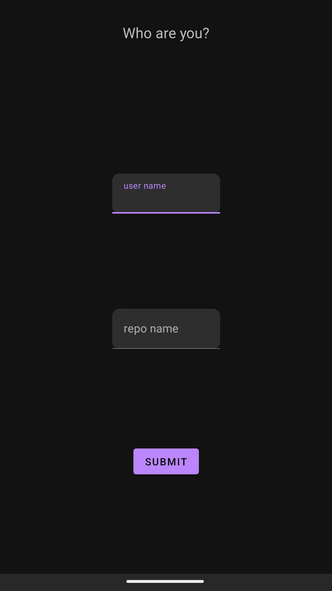
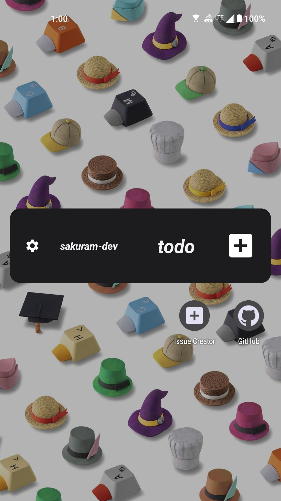
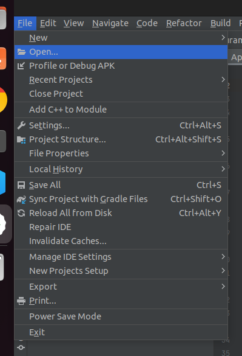

# IssueCreator

For developer who often use GitHub and creates issues.

## Features

- This is a widget that can be added to the home screen.

|Settings|Home Screen|
|---|---|
|||

- [Responsible Layouts](https://developer.android.com/develop/ui/views/appwidgets/layouts#provide-responsive-layouts)
  - The widget layout is responsive to the size of the widget.
- [Dark Theme](https://developer.android.com/develop/ui/views/theming/darktheme)
  - widget and settings theme is changed according to the system theme.

## Download
Please download the app from the Amazon App Store.  
[](https://www.amazon.com/gp/product/B0CR7TJ67S)


## Installation Locally
### Requirements
- Android Studio
- Android Emulator or Device
  - Android 12 (API level 31) or higher

### Step by Step
1. Clone the repository.
```bash
git clone https://github.com/sakuram-dev/IssueCreator.git
```
2. Open the project in Android Studio.
Files -> Open -> Select the project folder

3. Remove ads
- Remove code from the `res/layout/activity_main.xml` file.
- Remove code from the `src/main/java/com/sakuram/issuecreator/MainActivity.java` file.

4. Run the app.
  - Select the device or emulator and click the run button.
